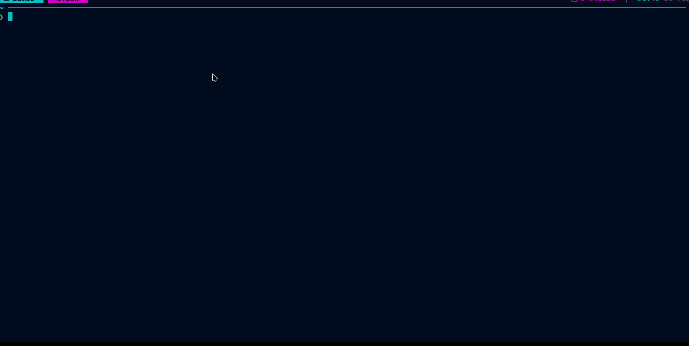

# tmux-claude-sessions

> Browse and resume all your Claude AI conversations directly from tmux

[](https://github.com/tmux-plugins/tpm)
[](https://github.com/tmux/tmux)
[](https://python.org)
[](LICENSE)



One keypress (`Prefix + g`) opens a floating popup listing every Claude
conversation, grouped by project, with a live preview on the right.
Select one to instantly resume it in a new tmux window.

---

## Install

### TPM

```tmux
set -g @plugin 'aomerk/tmux-claude-sessions'
```

Press `Prefix + I` to install.

### Manual (one line)

```bash
git clone https://github.com/aomerk/tmux-claude-sessions ~/.tmux/plugins/tmux-claude-sessions
```

Add to `~/.tmux.conf`:

```tmux
run-shell ~/.tmux/plugins/tmux-claude-sessions/tmux-claude-sessions.tmux
```

Reload: `tmux source ~/.tmux.conf`

---

## Requirements

| Dependency | Version | Notes |
|------------|---------|-------|
| [tmux](https://github.com/tmux/tmux) | ≥ 3.2 | For `display-popup` support |
| [fzf](https://github.com/junegunn/fzf) | any | Fuzzy finder |
| Python | 3.x | Ships with most systems |
| [Claude CLI](https://claude.ai/download) | any | `claude` must be in `$PATH` |

---

## Features

- **Instant access** — open from anywhere in tmux with one keypress
- **Grouped by project** — conversations organized under their source directory
- **Live preview** — full conversation rendered on the right as you browse
- **Smart dedup** — switching to an already-open session jumps to its window
- **Fuzzy search** — type to filter across all sessions and projects
- **Keyboard-driven** — vim-style navigation inside the preview pane
- **Configurable** — key binding, popup size, and projects directory are all overridable

---

## Configuration

Add to `~/.tmux.conf` before the `run-shell` / TPM line:

| Option | Default | Description |
|--------|---------|-------------|
| `@claude_sessions_key` | `g` | Trigger key (`Prefix` + this key) |
| `@claude_sessions_popup_width` | `80%` | Popup width |
| `@claude_sessions_popup_height` | `75%` | Popup height |
| `@claude_sessions_dir` | `~/.claude/projects` | Claude projects directory |

```tmux
set -g @claude_sessions_key 'C'
set -g @claude_sessions_popup_width '90%'
set -g @claude_sessions_popup_height '85%'
```

---

## Keybindings

Inside the popup:

| Key | Action |
|-----|--------|
| `Enter` | Open selected session |
| `Esc` / `Ctrl-c` | Close popup |
| `↑` / `↓` or `Ctrl-k` / `Ctrl-j` | Move selection |
| `J` / `K` | Scroll preview down / up |
| `g` / `G` | Preview top / bottom |
| `Ctrl-d` / `Ctrl-u` | Preview half-page down / up |
| `/` | Toggle preview pane |
| Type anything | Fuzzy-filter sessions |

---

## How it works

Claude CLI stores conversations in `~/.claude/projects/` with an encoded
directory naming scheme: each project path is flattened by replacing `/`
with `-` and `.` with `--`.

So `/home/alice/projects/webapp` becomes `-home-alice-projects-webapp`.

`picker.py` reverses this with a greedy filesystem walk, recovering the
real path for each project. Sessions are `.jsonl` files named by UUID.
`preview.py` renders the conversation with role badges. `open.sh` runs
`claude -r <session-id>` in a new tmux window, or switches to the
existing window if that session is already open.

---

## License

[MIT](LICENSE) © 2026 [aomerk](https://github.com/aomerk)
